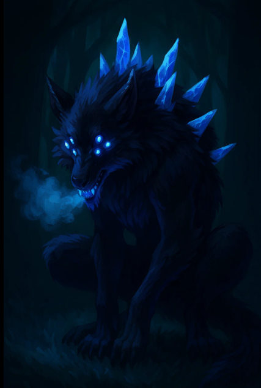

# Crystal Spined Wolves

**Type:** Aberrant Beast  

**Appearance:**  
Wolves with unnatural crystal spines protruding from their backs, faintly glowing blue in the moonlight.

Alpha - Larger predator with crystal-like protrusions running along its back, glowing with blue light. Moves unnaturally and blends with the mist. 

**Abilities - Alpha:**  
- Can speak, uttered a word that caused psychic/magical damage to the entire party.  
- Powerful physical attacker (able to grab and drag Lavinia into the mist).  
- Dissolves into mist when slain, leaving only a skull with runic carvings.

**Notable Details - Alpha:**  
- Runes are cult-like, not religious, appear Terravale-linked but unidentified.  
- Mist seems to respond to its presence, darkening during combat.  
- Defeated by Onyx, who impaled it with its own crystal spine.

**Notable Details:**  
- Appear during heavy mist events.  
- Crystal spines glow faintly blue.  
- Decompose rapidly into mist upon death.  
- Decomposition accelerates when exposed to magical light (e.g., shield glow).  

**First Appearance:** [Session 2](/campaigns/session-2.md)

**Known Encounters:**  
- Ambush near the ranch outside Valethorn.  
- Attacked cattle and settlers before being slain by the party.
- Left behind a **runed skull**, now in the party’s possession.

